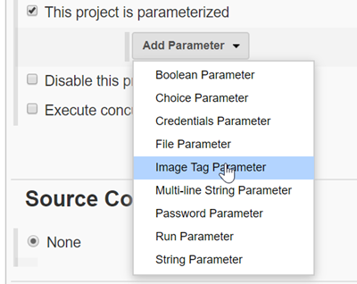
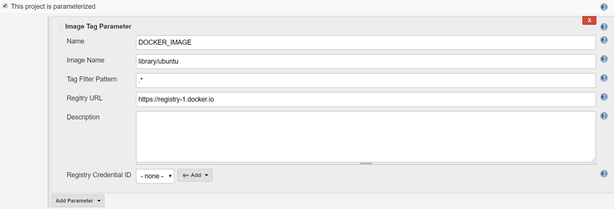
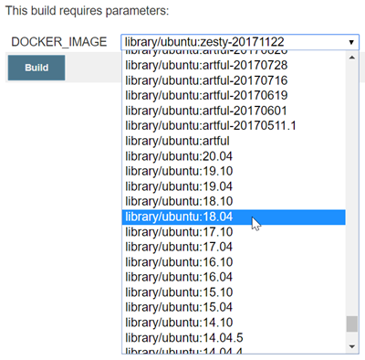

# Image Tag Parameter Plugin


[Changelog](CHANGELOG.md)

## Introduction
This plungins allows you to define (container) image tags as parameter in you builds.  
It use the Docker **Registry HTTP API V2** to list tags availaible for an image.

## Screenshots






## Usage

### Definition in Freestyle / Pipeline UI
This is basically showcased in the above [screenshots](#screenshots) :wink:

### Definition in Pipeline
```groovy
pipeline {
  agent any

  parameters {
    imageTag credentialId: '', description: '', filter: 'lts.*', image: 'jenkins/jenkins', name: 'DOCKER_IMAGE', registry: 'https://registry-1.docker.io'
  }

  stages {
    stage('Test') {
      steps {
        echo "$DOCKER_IMAGE"
      }
    }
  }
}
```

### Exposed Environment Variables (and params, since version 1.6) 
Based on default Jenkins behaviour you can use `params.imageTagParameterName` to access the value of `imageName:imageTag`,
but since you most of the time only need the image tag by itself the plugin also exports some additional environment variables.

* **$imageTagParameterName_TAG** (or *env.imageTagParameterName_TAG*) contains only the tag value without the image name
* **$imageTagParameterName_IMAGE** (or *env.imageTagParameterName_IMAGE*) contains only the name of the image without the tag


## how to build the Jenkins Plugin
 
### Install skdman
```
sudo apt install zip
curl -s "https://get.sdkman.io" | bash
source .sdkman/bin/sdkman-init.sh 
```

### install JDK and Maven
```
sdk install java 8.0.232-open
javac -version
sdk install maven
mvn -version
```

### install fontconfig on ubuntu
```
sudo apt install -y fontconfig
```
Error without fontconfig
```
Caused by: java.lang.NullPointerException
        at sun.awt.FontConfiguration.getVersion(FontConfiguration.java:1264)
        at sun.awt.FontConfiguration.readFontConfigFile(FontConfiguration.java:219)
```

### test, build and package
```
mvn verify
mvn hpi:run
mvn package
```
Plugin **./target/Image_Tag_Parameter.hpi** can be installed on any jenkins instance

### access the dev environment
Point the url to http://localhost:8080/jenkins

### Publish to Jenkins plugin repo
see https://wiki.jenkins.io/display/JENKINS/Hosting+Plugins#HostingPlugins-Releasingtojenkins-ci.org (.m2/settings.xml and ssh keys)
```
mvn release:prepare release:perform
```
